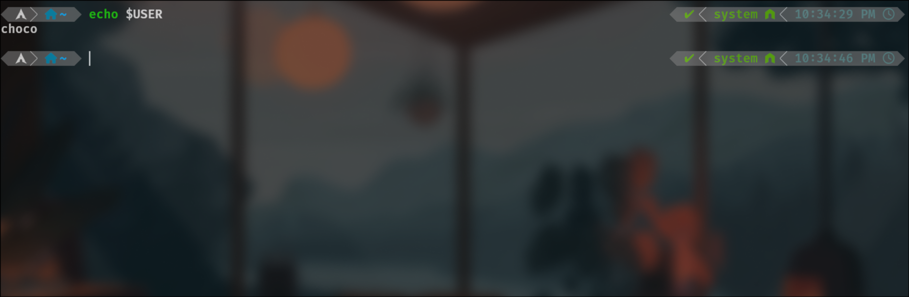

<h1 align="center">Personal Zsh Configuration</h1>

Welcome to the configuration hub for my Zsh shell! This directory holds all the details about the theme, plugins, and personal tweaks that make my Zsh setup unique. If you're looking to customize your own setup or are just curious about my configuration, you're in the right place.

## Table of Contents
- [Installation](#installation)
- [Plugins](#plugins)
- [Screenshots](#screenshots)

## Installation

I use the [Oh My Zsh](https://ohmyz.sh/) framework as the foundation of my Zsh setup, with a few tweaks to match my personal aesthetic. For the theme, I use the [Powerlevel10k](https://github.com/romkatv/powerlevel10k) theme, which offers a high degree of customization and a clean, modern look.

To install my zshrc setup, simply run this script:

```bash
curl -fsSL https://raw.githubusercontent.com/stellaOnEstrogen/dotfiles/main/machines/personal/scripts/install_zsh.sh | sudo bash
```

## Plugins

Here's a list of the plugins I use in my Zsh setup:

- [git](https://github.com/ohmyzsh/ohmyzsh/tree/master/plugins/git)
- [archlinux](https://github.com/ohmyzsh/ohmyzsh/tree/master/plugins/archlinux)
- [zsh-autosuggestions](https://github.com/ohmyzsh/ohmyzsh/tree/master/plugins/zsh-autosuggestions)
- [zsh-syntax-highlighting](https://github.com/ohmyzsh/ohmyzsh/tree/master/plugins/zsh-syntax-highlighting)

## Screenshots

Here’s a peek at my setup:


